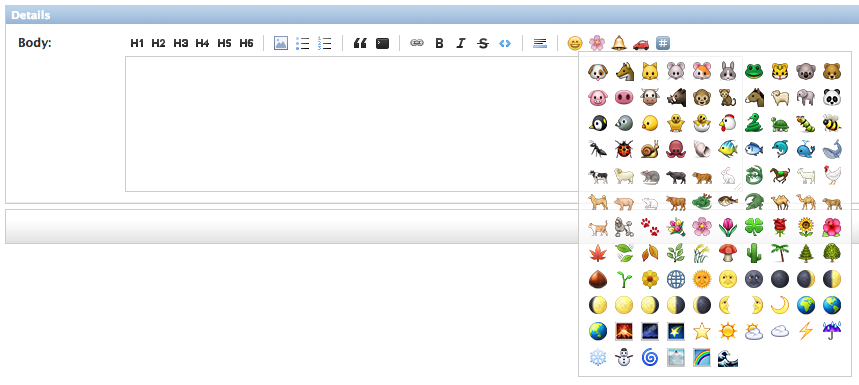

# Emo

**Emo** is a [Django](https://www.djangoproject.com/) [app](https://docs.djangoproject.com/en/1.5/intro/reusable-apps/) and [template filter](https://docs.djangoproject.com/en/dev/howto/custom-template-tags/) that enhances the [admin](https://docs.djangoproject.com/en/1.5/ref/contrib/admin/)'s textareas with a [Markdown](http://daringfireball.net/projects/markdown/)-[emoji](http://en.wikipedia.org/wiki/Emoji) enhanced toolbar.




## Features

Emo uses the [markItUp](http://markitup.jaysalvat.com/home/) toolbar for adding Markdown to textareas. Its toolbar is themed to complement the minimalism of the admin.

The toolbar's emoji icons use the Apple iOS emoji icon set. Although emoji became a [Unicode standard](http://www.fileformat.info/info/unicode/block/miscellaneous_symbols_and_pictographs/images.htm), some browsers (ahem, Chrome) still do not support the emoji HTML entities. Emo instead uses the [GitHub-flavored Markdown codes](http://www.emoji-cheat-sheet.com/) and a filter to replace the emoji text codes with their respective image equivalents.


## Installation

Install it with the [pip](http://www.pip-installer.org/) package manager.

```
pip install -e git+https://github.com/richardcornish/django-emo.git#egg=django-emo
```

Remember to update to your requirements.txt file. In your project directory:

```
pip freeze > requirements.txt
```

Edit your `settings.py`:

```
INSTALLED_APPS = (
    # ...
    'emo',
)
```

Append `class Media` parts to admin classes in each of your apps' `admin.py`. Example:

```
from django.contrib import admin
from .models import Post

class PostAdmin(admin.ModelAdmin):

    # ...

    class Media:
        css = {
            'all': ('emo/css/style.min.css',)
        }
        js = ('emo/js/alias.min.js', 'emo/js/markitup.min.js', 'emo/js/emo.min.js',)

admin.site.register(Post, PostAdmin)
```

Override the admin's `change_form.html` template for the app of your choosing.

```
<!-- blog/templates/admin/blog/post/change_form.html -->




    {{ block.super }}
    <script>
        django.jQuery(function () {
            'use strict';
            Emo.addToolbar('#id_body'); // Selector of desired textarea
        });
    </script>

```

More at:

- [`ModelAdmin` media definitions](https://docs.djangoproject.com/en/dev/ref/contrib/admin/#modeladmin-asset-definitions)
- [Overriding admin templates](https://docs.djangoproject.com/en/dev/ref/contrib/admin/#overriding-admin-templates)

Remember to add [static file handling to your local settings](https://docs.djangoproject.com/en/dev/ref/contrib/staticfiles/#static-file-development-view) or run `python manage.py collectstatic` in the correct django project directory live and restart the server as necessary.


## Usage

Load the template tag in your template. Run it on an attribute of a variable:

```


{{ post.body|emo }}
```

Note that the [`django.contrib.markup`](https://docs.djangoproject.com/en/1.5/ref/contrib/markup/) module has been deprecated since Django 1.5 and that a textarea using Markdown will not render HTML. Assuming you either [bring back the module](https://github.com/django/django/blob/1.5/django/contrib/markup/templatetags/markup.py) or you install a [third-party Markdown solution](https://pypi.python.org/pypi/django-markup-deprecated), and add the package to your `INSTALLED_APPS`, the template would probably more closely resemble:

```


{{ post.body|markdown|emo }}
```

If you do copy the old `markup.py` module, please alter the last section of the source by including the [security update](https://www.djangoproject.com/weblog/2015/apr/21/docutils-security-advisory/).